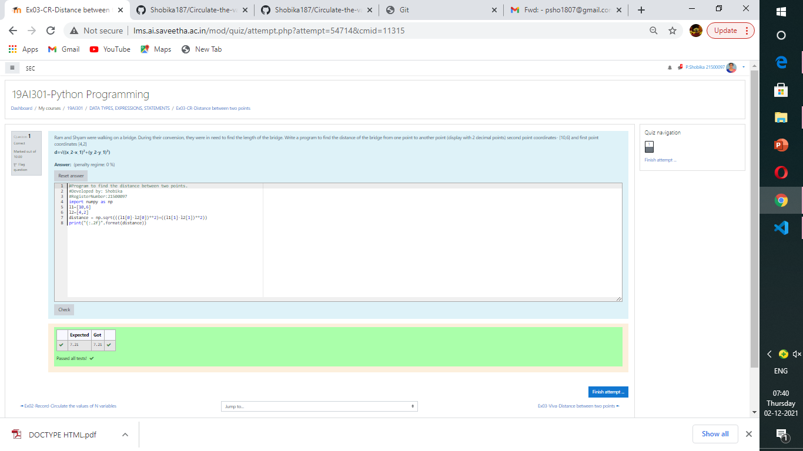

# DISTANCE-BETWEEN-TWO-POINTS

## AIM:
To write a python program to find the distance two 2 points
## ALGORITHM:
### Step 1: import numpy as np
### Step 2: Get the import matrix
### Step 3: 
Substitute the values in the distance formula  
### Step 4: make two variables
### Step 5: print the result
### PROGRAM:
~~~
  import numpy as np
l1=[10,6]
l2=[4,2]
distance = np.sqrt(((l1[0]-l2[0])**2)+((l1[1]-l2[1])**2)) 
print("{:.2f}".format(distance)) 

~~~
## OUTPUT:

### RESULT:
